# Deutschstagram

## Brief

As a group, create a MERN stack application (MongoDB, Express, React, Node) with RESTful routes.

## Timeframe & Team

7 days, 3 people group project (alongside Guy https://github.com/gaebar and Mia https://github.com/MiaLearnsToCode)

Original group project is Vietgram (https://vietgram-ga.herokuapp.com/), I re-designed the app to Germany after the course, as practice. Functionally it is identical, but all of the necessary parts of the seeds file and nation/translation links elsewhere are changed.

Project is live here https://deutschstagram.herokuapp.com/

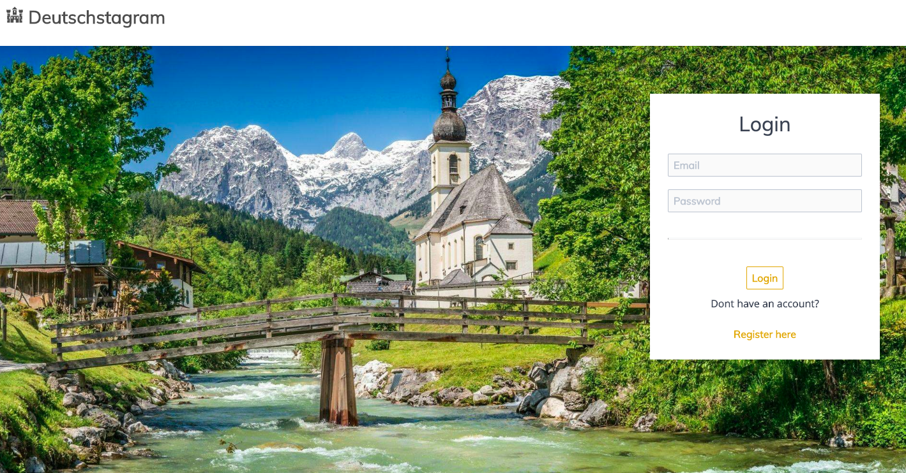

## Technologies
- React
- Node
- Express
- MongoDB
- Mongoose
- Spectre.css
- Mocha & Chai
- Git
- Heroku

## Theme

The concept was to create an instagram-like image sharing board that users can like, comment, follow users and edit their own entries. Additionally, a language option is included for the chat section, where the user can see the chat messages in their selected language.

## Controls

###### Register and Log In to the App.

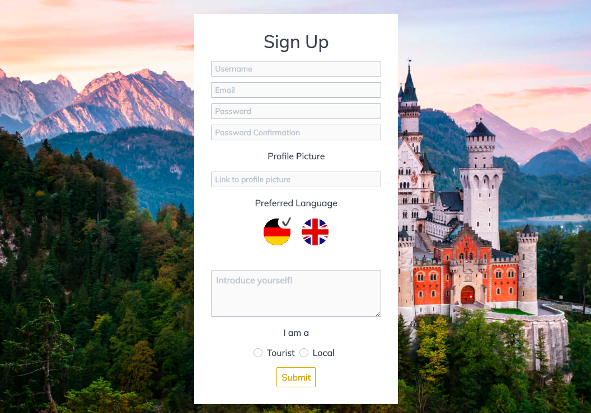

###### Select navigation from profile icon on top right.

###### Image(known as Gems) board, where you can see the index.

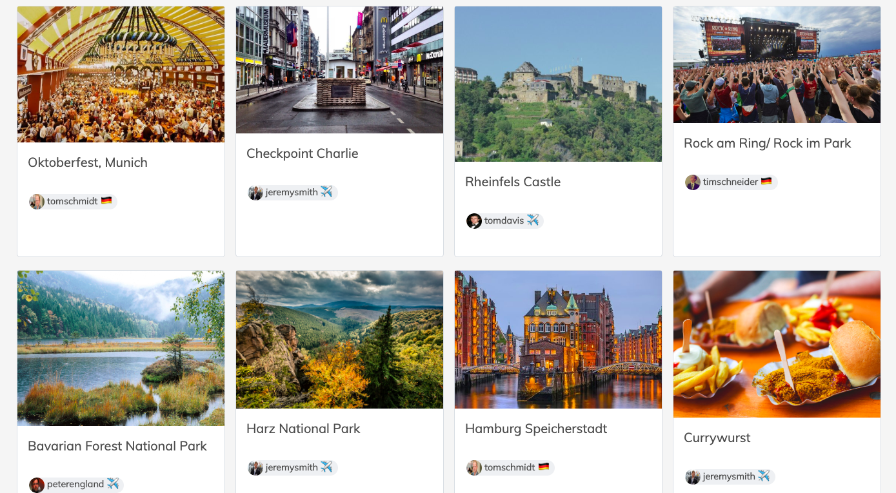

###### Post new gems.

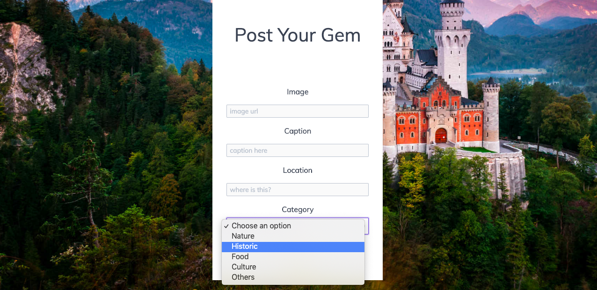

###### Edit ones you've made.

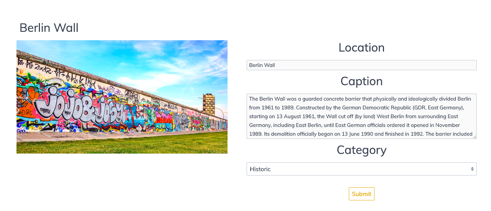

###### Make comments on gems and delete comments you've made.

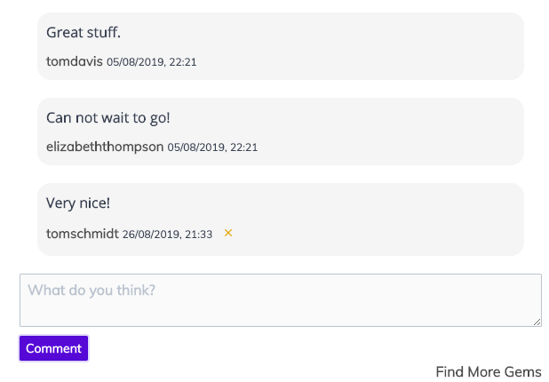

###### Chat section, where you can see comments by different users in the language that you prefer, chosen when joining the site. Emoji picker is also added so it functions close to the real messaging services

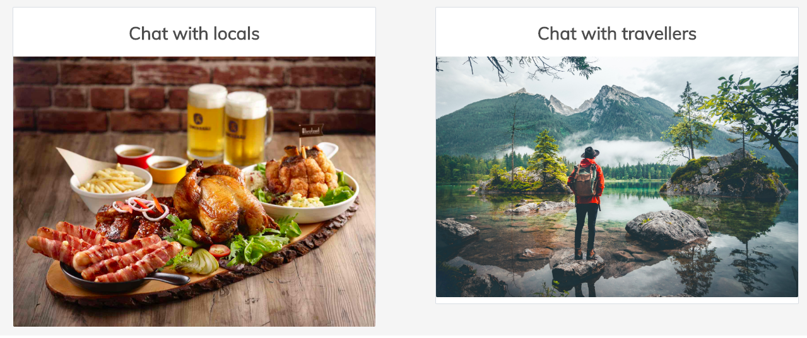

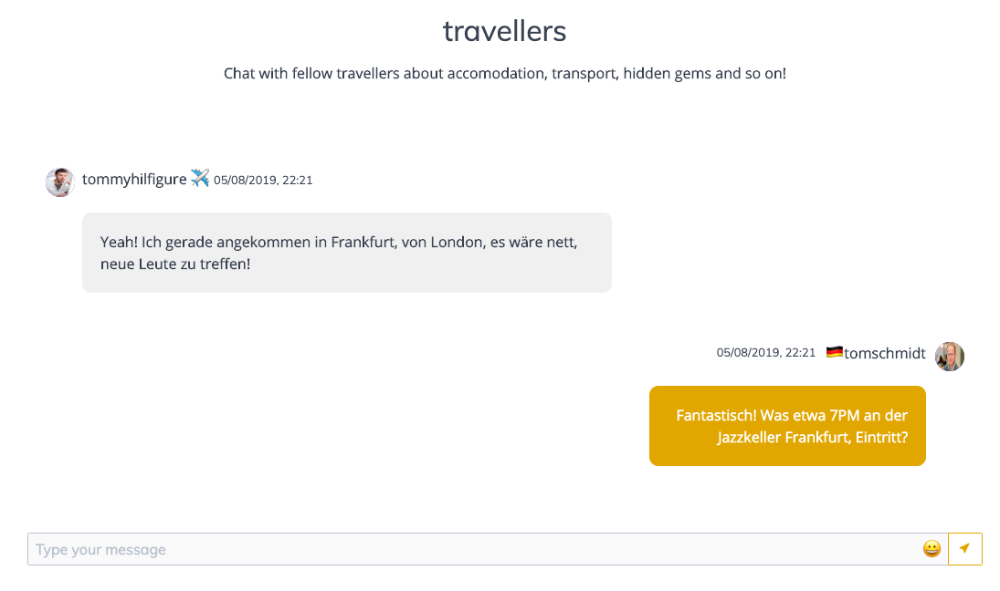

## Node.js

The models and controllers are seperated into 3 categories: chats, gems and users. With varying usages of the RESTful routes, since gems would require all the routes while chats and users require less.

###### Router keeps all the routes of the Backend in one place and so easier to manage.

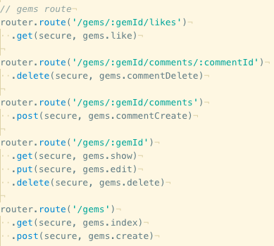

###### Error Handler gives all error messages a numbered status and can be applied for all the errors across the Backend.

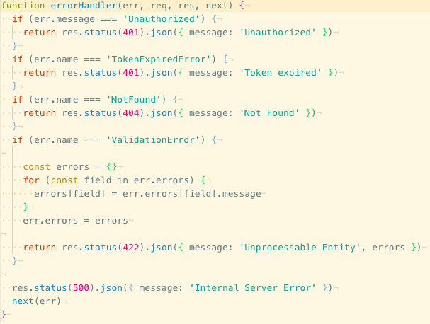

###### Logger manages the console.log that informs you of all the backend RESTful requests that are happening while using the site.

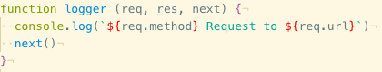

###### Secure Route checks that the Authorization token is present and manages the JSON Web Token through a Promise.

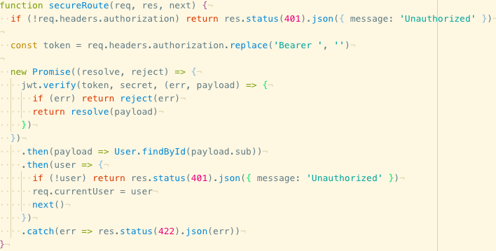

###### The Seeds file contains all the creative content from user profiles, gems to chats that makes up the pre-filled portion of the site.

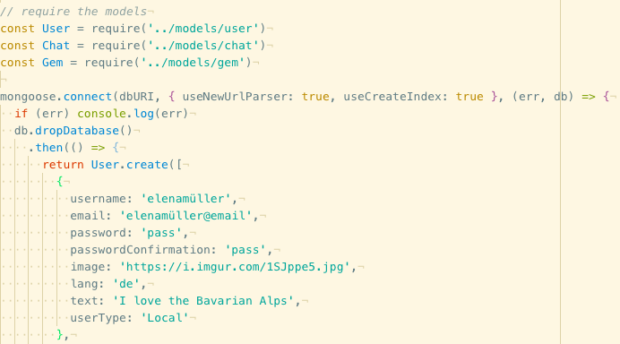

## React.js

Each RESTful path from the backend has its own component which manages the functions and requests on the page. Many have the handleChange and handleSubmit functions that are linked to elements going into render.

###### From the ChatShow component:

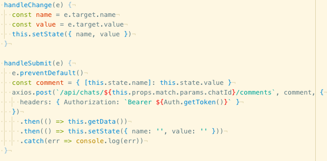

###### The filter Gems option is done almost entirely on React, using the category data from seeds, the Gems are filtered to show only the categories selected.

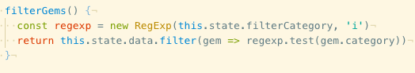

###### Render example:

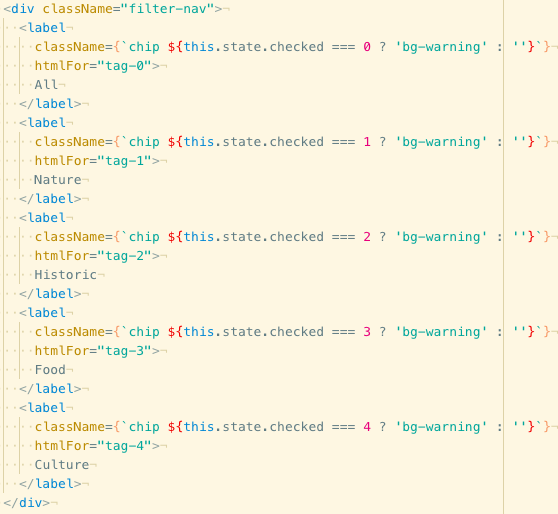

###### The Gem component gets referenced directly into Gems and acts as a huge function outside of the component, where the design and references to the seeds file is managed. A crucial part of the whole app.

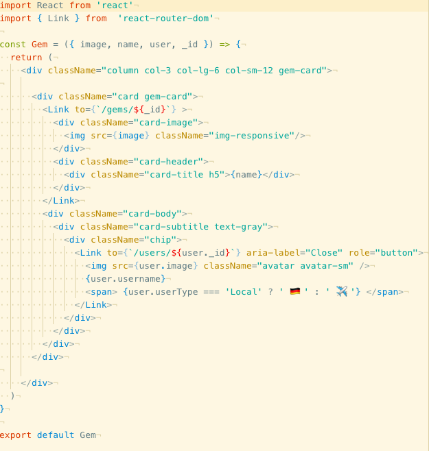

###### Auth handles the log in and authentication for the user. Giving a token that expires after a set time when the user log in. Removes the token while logging out.

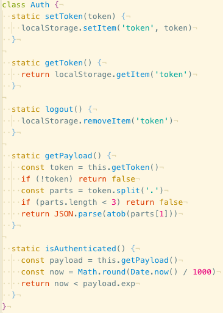

###### Chat Show handles a lot of visual presentation that requires authentication and user information, the comments are presented in the profile's selected language.

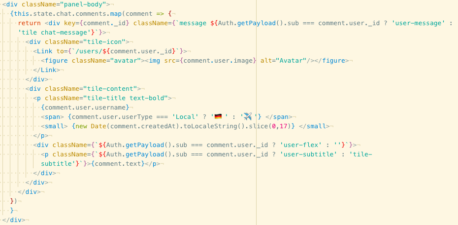

###### App.js contains the BrowserRouter which easily manages the switching of different routes.

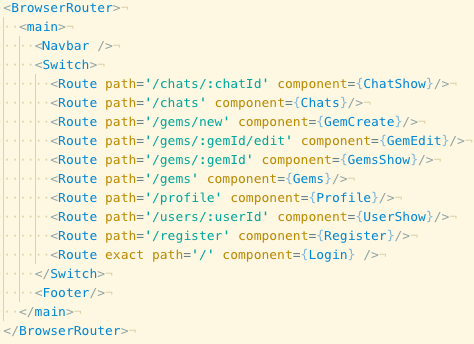

## Wins

Dividing tasks on Trello proved to be highly efficient and saved a huge amount of time as there was a very clear task and timeframe that was manageable. For example, three people working on a model each on Node was hugely efficient and it was done in two hours or so. Git management was also very secure as we coordinated nicely side by side.

The App manages to contain many small quality of life additions from likes to followers that it really mimics the vast functionality of a global platform such as Instagram. Really happy with the outcome.

## Challenges and Main Takeaways

Once the concept was created we hadn't got much time to change ideas, because of the scale of the app for 7 days.

For me personally it was a great learning experience being hands on at every stage of the Full Stack App. One of the hardest parts of the App was the chat section- where the controller manages the translation on the backend and to have it seamlessly be presented on the frontend. On that Chat Show page we also added an Emoji Picker extension that proved to be fairly complex to use, requiring multiple functions to implement.

Finally, the styling on that particular page was quite challenging and requires going back to flex-box as well as the in-built functionalities that comes with Spectre.css

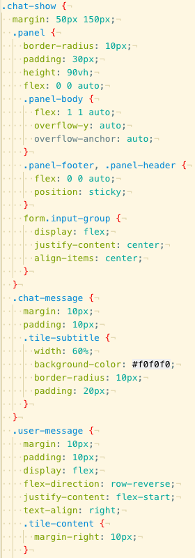

## Future Improvements

A more seamless register and login process, as well as helpful messages about how to set up the profile and use the App would be beneficial. Direct Messages between users who follow each other would also be a nice addition.
