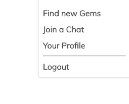

# sei-group-project-3

General Assembly Project 3: Deutschstagram
==========================
1 week long 3 people group project (alongside Guy https://github.com/gaebar and Mia https://github.com/MiaLearnsToCode)

Full stack: React.js, Node.js, Express, MongoDB

Style-framework: Spectre.css

Original group project is Vietgram (https://vietgram-ga.herokuapp.com/), I re-designed the app to Germany after the course, as practice. Functionally it is identical, but all of the necessary parts of the seeds file and nation/translation links elsewhere are changed.

Theme
==========
The concept was to create an instagram-like image sharing board that users can like, comment, follow users and edit their own entries. Additionally, a language option is included for the chat section, where the user can see the chat messages in their selected language.

Controls
===========
Register and Log In to the App.

Select navigation from profile icon on top right.

Image(known as Gems) board, where you can see the index.

Post new gems.

Edit ones you've made.

Make comments on gems and delete comments you've made.

Chat section, where you can see comments by different users in the language that you prefer, chosen when joining the site. Emoji picker is also added so it functions close to the real messaging services

Node.js
============
The models and controllers are seperated into 3 categories: chats, gems and users. With varying usages of the RESTful routes, since gems would require all the routes while chats and users require less.

Router keeps all the routes of the Backend in one place and so easier to manage.

Error Handler gives all error messages a numbered status and can be applied for all the errors across the Backend.

Logger manages the console.log that informs you of all the backend RESTful requests that are happening while using the site.

Secure Route checks that the Authorization token is present and manages the JSON Web Token through a Promise.

The Seeds file contains all the creative content from user profiles, gems to chats that makes up the pre-filled portion of the site.

React.js
============
Each RESTful path from the backend has its own component which manages the functions and requests on the page. Many have the handleChange and handleSubmit functions that are linked to elements going into render.

From the ChatShow component

The filter Gems option is done almost entirely on React, using the category data from seeds, the Gems are filtered to show only the categories selected.

Render example:

The Gem component gets referenced directly into Gems and acts as a huge function outside of the component, where the design and references to the seeds file is managed. A crucial part of the whole app.

Auth handles the log in and authentication for the user. Giving a token that expires after a set time when the user log in. Removes the token while logging out.

Chat Show handles a lot of visual presentation that requires authentication and user information, the comments are presented in the profile's selected language.

App.js contains the BrowserRouter which easily manages the switching of different routes.

